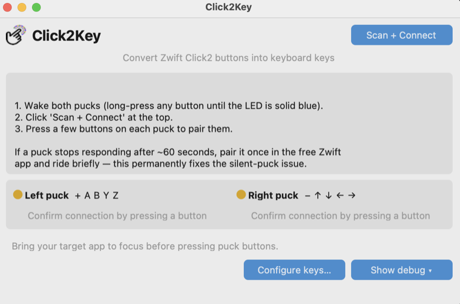
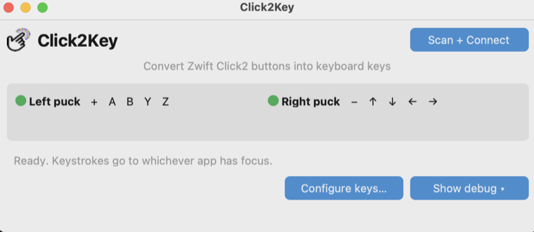

# Click2Key

Turn your **Zwift Click V2** controller into keyboard shortcuts. Works with
any app that takes keystrokes — MyWhoosh, Zwift, indieVelo, a text editor,
whatever's focused.

Runs on macOS and Windows.

## What you get

- Both Click V2 pucks paired over BLE
- Each of the 10 physical buttons (+, A, B, Y, Z on the left; −, ↑, ↓, ←, →
  on the right) mapped to a keystroke
- A configurable mapping (default fits MyWhoosh's shortcuts; rebind to
  whatever)
- A small in-app log + permission shortcuts for troubleshooting

## Screenshots

First launch — wake your pucks, then hit *Scan + Connect*:



Both pucks connected and ready — keystrokes go to whichever app has focus:



## Install (macOS)

Download `Click2Key-macos-arm64.zip` from the
[latest release](https://github.com/skeffling/click2key/releases/latest),
then:

```bash
unzip ~/Downloads/Click2Key-macos-arm64.zip -d /Applications/
xattr -dr com.apple.quarantine "/Applications/Click2Key.app"
open "/Applications/Click2Key.app"
```

First run: macOS prompts for **Bluetooth**. Then grant **Accessibility** in
System Settings → Privacy & Security → Accessibility — add
`/Applications/Click2Key.app`. Quit + relaunch.

Prefer to build from source? `python3 -m venv .venv && ./build_macos.sh`
drops `Click2Key.app` in `dist/`.

## Install (Windows)

Download `Click2Key-windows-x64.zip` from the
[latest release](https://github.com/skeffling/click2key/releases/latest),
unzip it anywhere, and run `Click2Key.exe` inside the unzipped folder.
The `.exe` needs the sibling `_internal\` directory, so keep the folder
intact.

To build yourself on a Windows machine with Python 3.12+:

```cmd
py -m venv .venv
build_windows.bat
```

## Use it

1. Long-press any button on each puck until the LED is solid blue.
2. Launch Click2Key. It scans automatically.
3. Press any button on each puck so it shows green in the UI.
4. Bring your target app to focus.
5. Press a puck button → corresponding key fires.

Open *Configure keys…* in the debug pane to remap. Defaults are MyWhoosh's
published shortcuts (K = shift up, I = shift down, arrows for nav).

## 60-second sleep workaround

Out of the box, a Click V2 may stop emitting button events ~60 s after
connecting to a non-Zwift app. The fix (once, then forever): pair the
Click in the free Zwift app and ride briefly. After that, all third-party
apps work without interruption. See the
[BikeControl issue](https://github.com/OpenBikeControl/bikecontrol/issues/68)
for the thread.

## Run from source

```bash
python3 -m venv .venv
.venv/bin/pip install -e .
.venv/bin/click2key
```

## Protocol notes

- Click V2 sends button state as `0x23 0x08 <protobuf-varint-bitmap>` on
  the async characteristic of service `0000fc82-…`. Bitmap is active-low.
- Both pucks broadcast each other's button events; `EventDeduper` collapses
  the duplicates inside a 75 ms window.
- Bits: left puck `+`=12, `A`=4, `B`=5, `Y`=6, `Z`=7; right puck `−`=8,
  `↑`=3, `↓`=1, `←`=2, `→`=0.

## References

- <https://github.com/ajchellew/zwiftplay> — Zwift Play/Ride/Click-V2
  reference (encrypted handshake; turns out V2 also speaks the plaintext
  bitmap protocol if you skip ECDH).
- <https://github.com/OpenBikeControl/bikecontrol> — inspiration.
